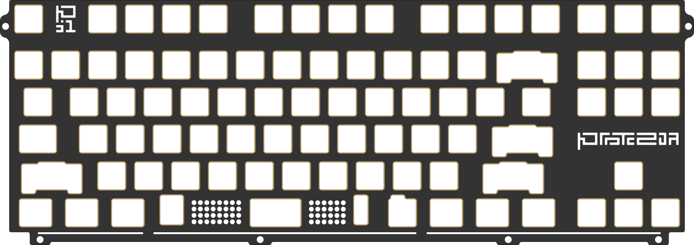
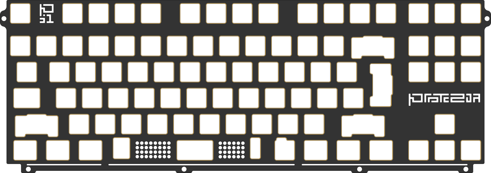
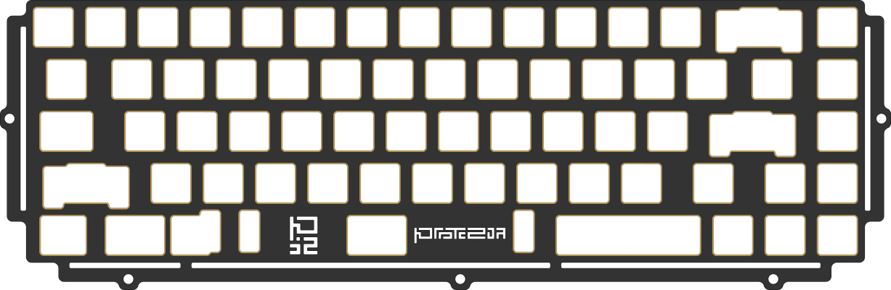
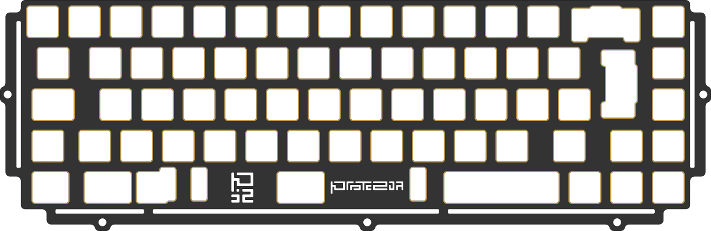
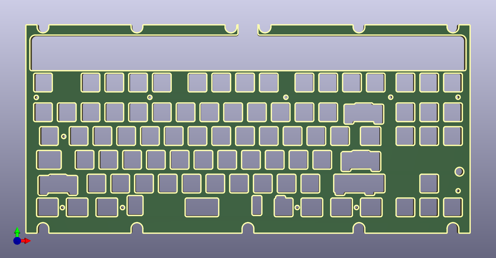
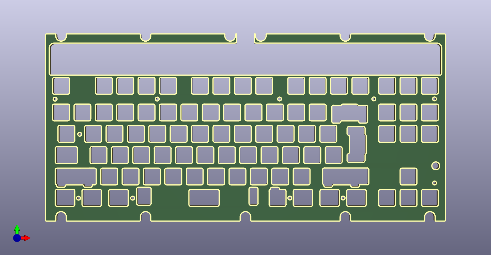
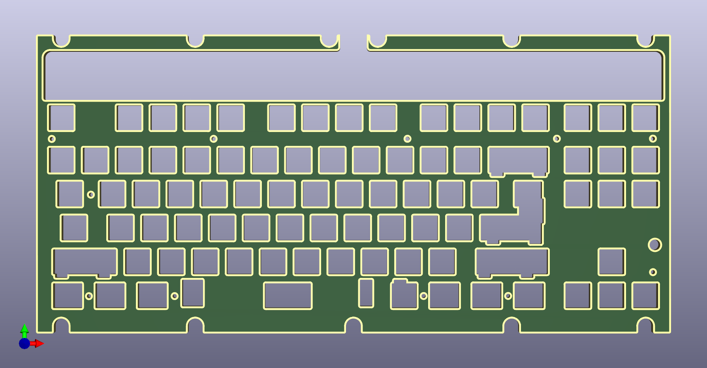
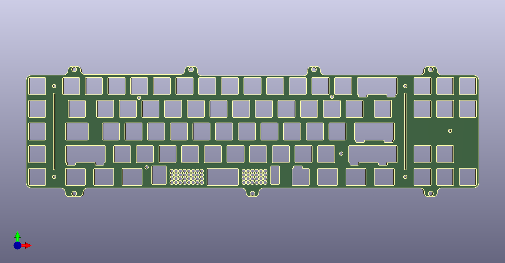
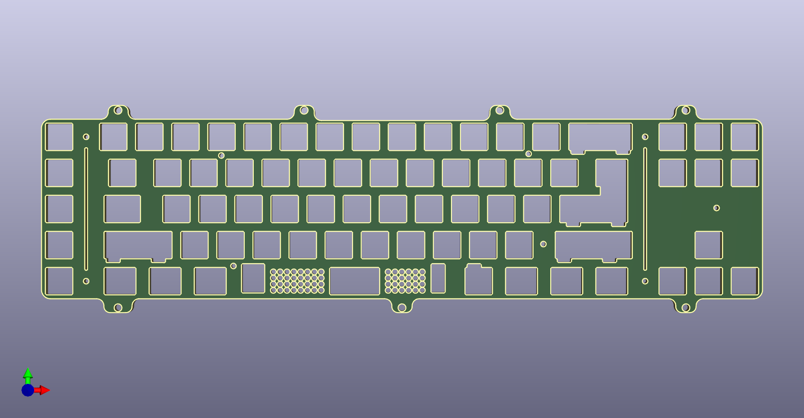

# Production-ready FR4 plates for all [Protozoa](https://protozoa.studio/) keyboards.

[![CC BY-NC-SA 4.0][cc-by-nc-sa-image]][cc-by-nc-sa]  
This project is licensed under the **[Attribution-NonCommercial-ShareAlike 4.0](http://creativecommons.org/licenses/by-nc-sa/4.0/)** license, meaning you cannot use the project to generate income. If you ask me (@ellafyi on Discord), and also have permission from someone at [Protozoa Studio](https://protozoa.studio/), you are free to use these for a Group Buy or similar.

Gerber files for each of the plates (ISO & ANSI, see below) can be found in the Release section on the right.
To get as close to the renders below as possible, choose Black Soldermask and ENIG Surface Finish  
If your PCB manufacturer doesn't autofill the dimensions after uploading the gerbers, use these dimensions:

P.01: **358.4 x 126.7**  
P.02: **325.0 x 106.5**  
Strata: **357.02 x 167.97**  
Foundation: **381.05 x 109.9**

## P.01 ANSI PLATE

## P.01 ISO PLATE

## P.02 ANSI PLATE

## P.02 ISO PLATE

## Strata ANSI PLATE

## Strata ISO PLATE

## Strata Universal PLATE

## Foundation ANSI PLATE

## Foundation Universal PLATE

[cc-by-nc-sa]: http://creativecommons.org/licenses/by-nc-sa/4.0/
[cc-by-nc-sa-image]: https://licensebuttons.net/l/by-nc-sa/4.0/88x31.png
[cc-by-nc-sa-shield]: https://img.shields.io/badge/License-CC%20BY--NC--SA%204.0-lightgrey.svg
